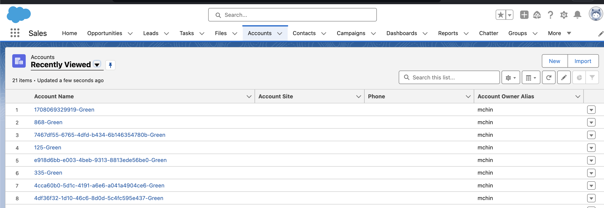

# Using UUID in test classes instead of time based for  unique values



- From Spring 24 release we have released [UUID](https://help.salesforce.com/s/articleView?id=release-notes.rn_apex_uuid.htm&release=248&type=5)
- For Earlier Relases use [Jon's Uuid](https://github.com/jongpie/ApexUUID/blob/main/apex-uuid/classes/Uuid_Tests.cls)


### Avoid the following methods using ```System.now()``` based method  to create unique value 
- The accuracy depends on the underlying machine
- Clock skews in the machines may generate duplicates value when multiple machines are used in parallel

- [Sample code](./uuid.cls)
